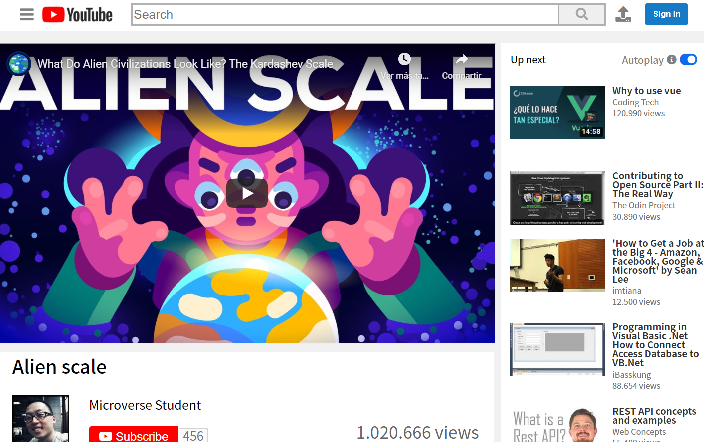

# Youtube cloned

> Made as the first HTML/CSS project in the Microverse curriculum

## Built With

- HTML
- CSS

## Live Demo

[Live Demo Link](https://karmaester.github.io/Youtube-Cloned/)

## Authors

👤 **karmaester**

- Github: [@githubhandle](https://github.com/karmaester)
- Twitter: [@twitterhandle](https://twitter.com/karmaendlich)
- Linkedin: [linkedin](https://www.linkedin.com/in/khristian-rojas/)

👤 **len23**

- Github: [@githubhandle](https://github.com/len23)
- Twitter: [@twitterhandle](https://twitter.com/lenon468)
- Linkedin: [linkedin](https://www.linkedin.com/in/lenin-montalvo-77660b1b2/)

## 🤝 Contributing

Contributions, issues and feature requests are welcome!

Feel free to check the [issues page](https://github.com/karmaester/Youtube-Cloned/issues).

## Show your support

Give a ⭐️ if you like this project!

## Acknowledgments

- Inspired on older versions of Youtube together with more recent ones

## 📝 License

This project is [MIT](lic.url) licensed.
